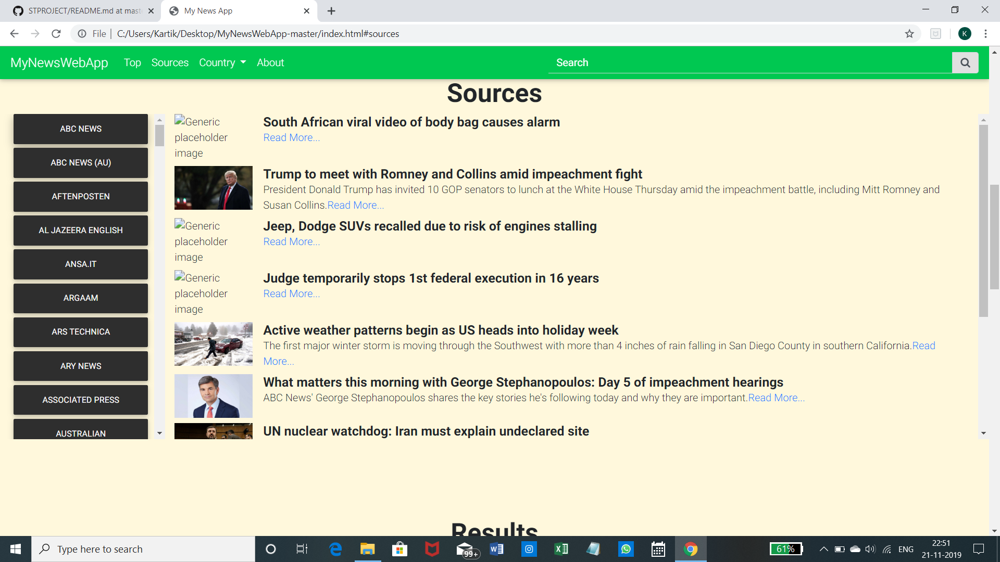

# FrontEnd Short-News Website
A  news website for the daily to daily trending news of  Countries here 2
ie US and India.
 

# Technologies Used -
## HTML
## CSS
## BOOTSTRAP
## JAVASCRIPT
## JQUERY
## AJAX

# List of Endpoints - 
## Country News :- https://newsapi.org/v2/top-headlines  (api link)[authorization/verification done]
 
 
## Search Bar Results :-https://newsapi.org/v2/everything (api link)[authorization/verification done]
 
 
## Top News :- https://newsapi.org/v2/sources/
 

 ## SourcesResult :- https://newsapi.org/v2/sources/
  

# Live Link : - <a href=https://varunbhatnagar99.github.io/STPROJECT/.> Have a look at my project </a>